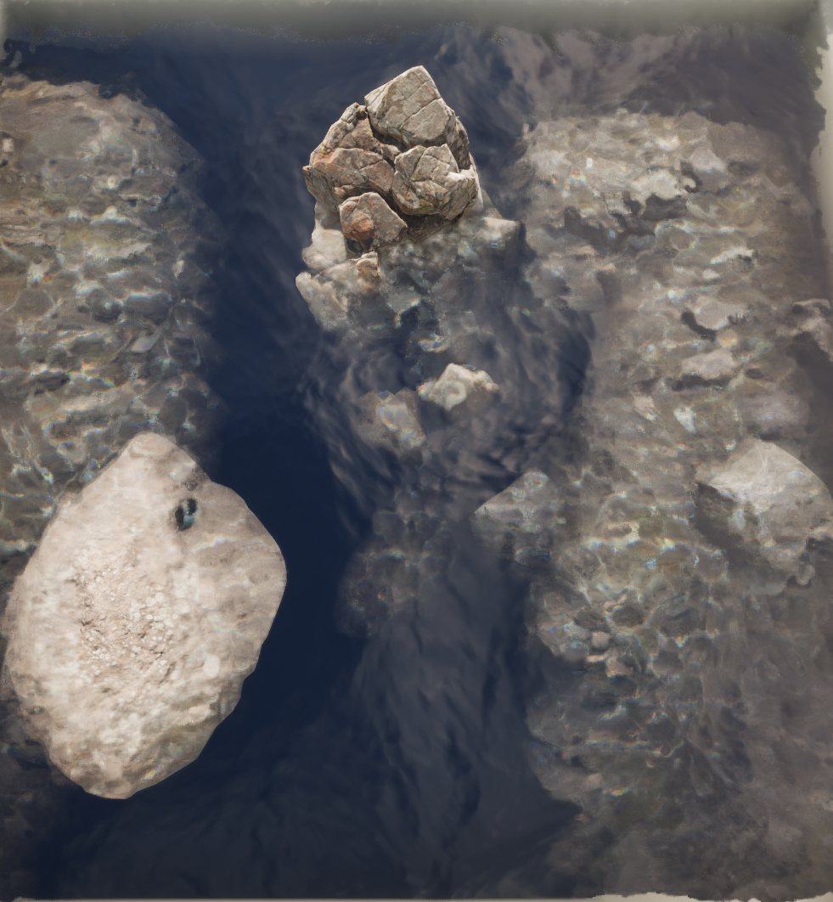
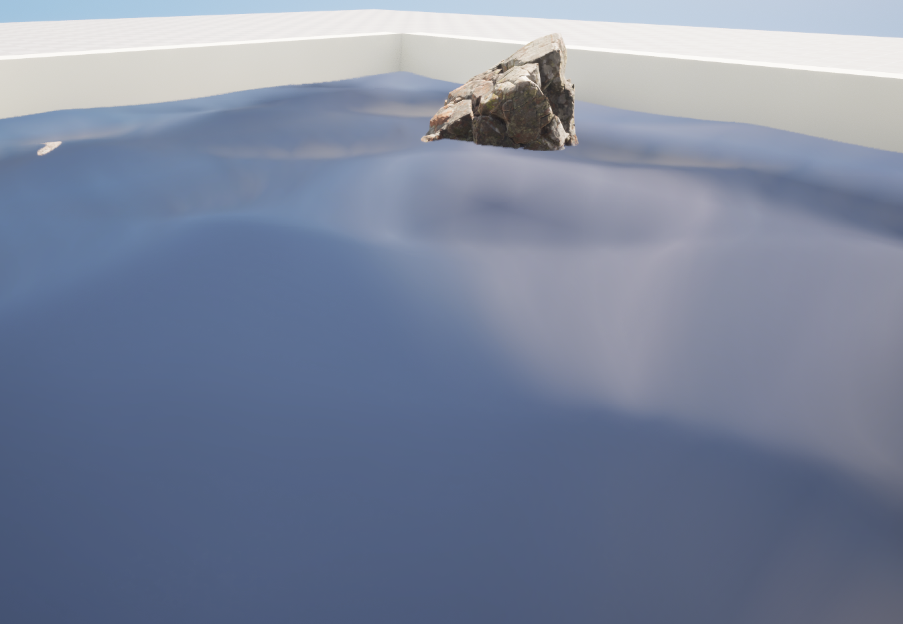
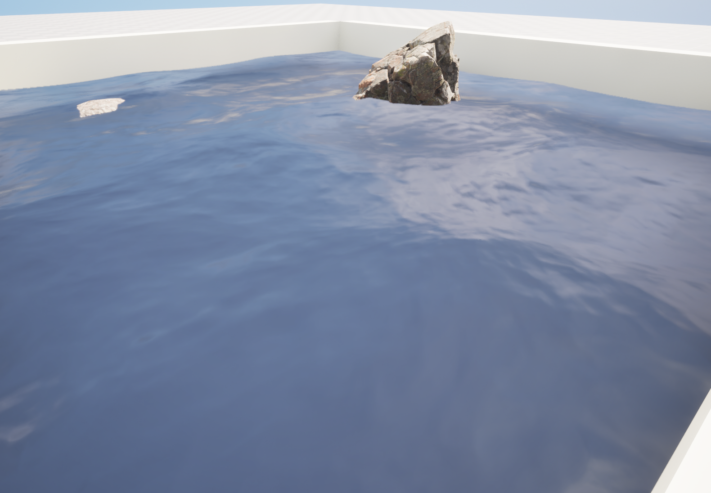
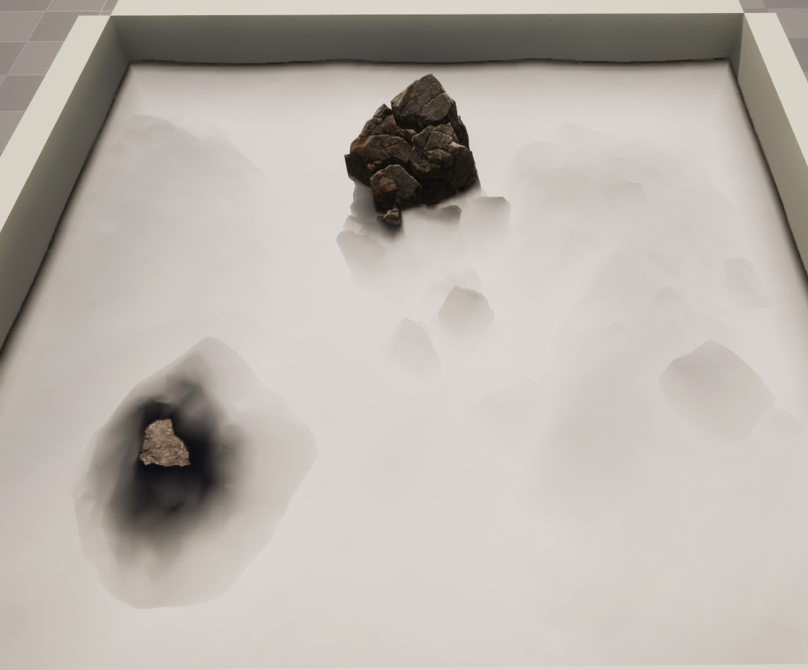
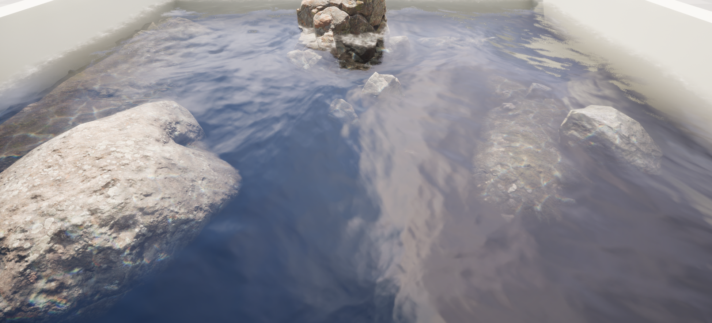
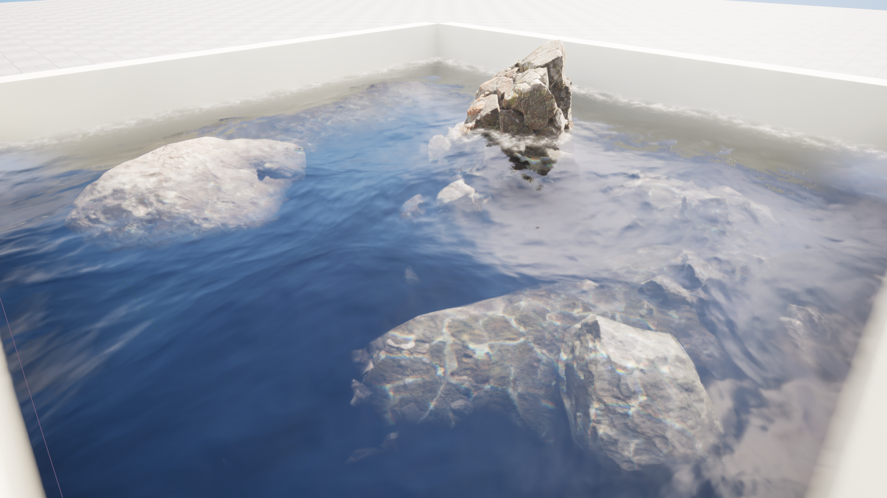
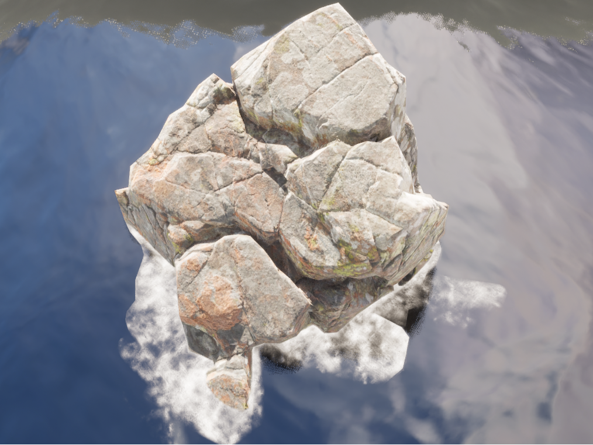
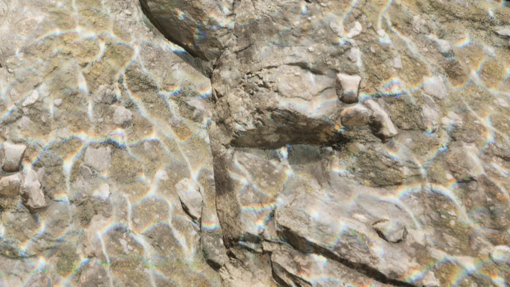
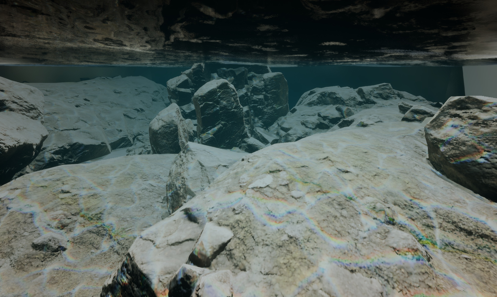
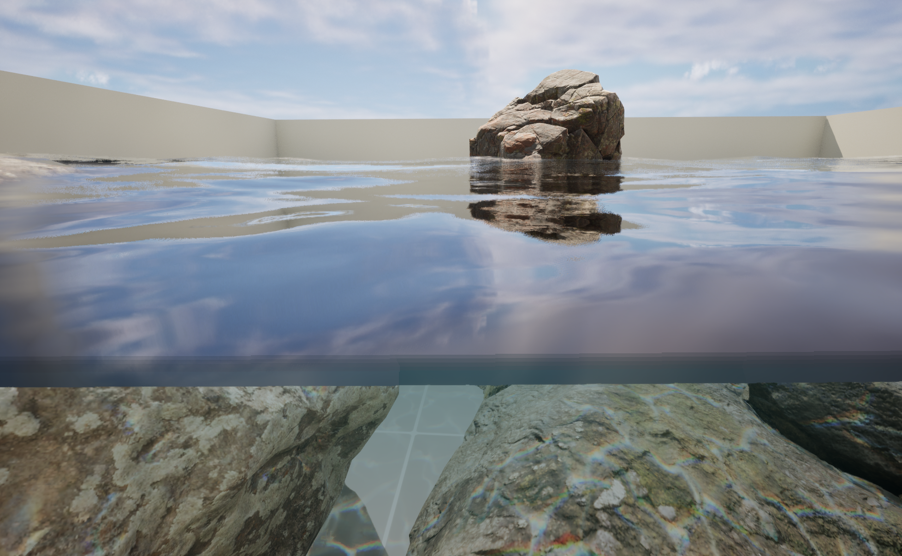

# Realistic Water in Unreal Engine

**Real-time water shader and underwater visual effect development in Unreal Engine 5.4**  
A project focused on **Technical Art**, **computer graphics**, **shader/material development**, **real-time rendering**, and **visual problem solving**.

#### Water shader in a small setup

## Overview

This project explores how to build a visually convincing water system in **Unreal Engine 5.4** for real-time environments.  
The work combines **procedural wave motion**, **material layering**, **depth-based shading**, **foam**, **caustics**, **refraction**, and **underwater post-processing** into a single real-time workflow.

It was developed with a strong focus on both **art direction** and **technical implementation**, reflecting the type of work expected in **Technical Artist** and **real-time graphics** roles.

## Key Features
- **Gerstner Waves** for procedural water surface motion

- Layered **Normal Maps** for small-scale ripple detail

- **Depth-based transparency** for shallow/deep water appearance

- **Fresnel** control for view-dependent surface response

- **Refraction** for surface distortion

- Procedural **foam masking** around intersecting geometry

- Animated **caustics** for underwater light projection

- **Post Process** underwater effect using **Custom Depth / Stencil**

- **Waterline** split-view effect for half-submerged camera transitions

## Technical Artist Focus

This project highlights skills relevant to **Technical Artist** positions:

- **Shader Development**
- **Material Authoring**
- **Look Development**
- **Real-Time VFX Integration**
- **Rendering Debugging**
- **Optimization**
- **Node-based technical problem solving**
- Bridging **artistic goals** and **engine constraints**
- Iterative workflow from prototype to final visual result

## Tools & Tech

- **Unreal Engine 5.4.4**
- **Material Editor**
- **Material Functions**
- **Post Process Materials**
- **World Position Offset**
- **Scene Depth / Pixel Depth**
- **Custom Depth / Stencil**
- **3ds Max**
- **Photoshop**

## Selected Challenges

### Mesh Resolution and Wave Deformation
The initial water mesh did not deform convincingly under **World Position Offset**.  
I identified the issue as insufficient mesh density and replaced it with a higher-resolution mesh created in **3ds Max**, which significantly improved wave quality.

### Underwater Mask Debugging
The underwater effect required a **Stencil Mask** setup to separate underwater and above-water rendering.  
During debugging, I found that default settings such as **Render in Depth Pass** and **Affect Dynamic Indirect Lighting** caused rendering artifacts and incorrect darkening on the water surface. Adjusting these settings resolved the issue.

### Material Cost and Optimization
As the shader became more feature-rich, instruction cost increased.  
I used **Vertex Interpolator**-based optimization in parts of the material graph to reduce some **Base Pass** cost and improve efficiency.

## Media

#### Water shader in a large scene

## Author

**Shiyi Gou**  
M.Sc. Human-Computer Interaction, LMU Munich  
B.Sc. Informatics plus Computer Linguistics
